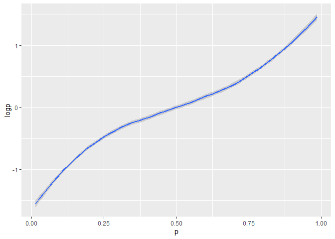

Linear Regression for Prediction
================
PK (Kasidit) Ratanavijai
07/13/2019

## Linear Regression for Prediction

Let’s describe the function predict. The predict function is very useful
for machine learning applications. This function takes a fitted object
from functions such a lm or glm and a data frame with the new predictors
for which you want to predict and returns a prediction.  
Go back to our son and father’s height example.  
We will build the algorithm that predicts the son’s height y using the
father’s height x.

``` r
y = galton_heights$son
test = createDataPartition(y, times = 1, p =0.5, list = FALSE)
#assign test and train sets.
train_set = galton_heights%>% slice(-test)
test_set = galton_heights%>% slice(test)
```

``` r
#for estimating the slope and intercept. We can write this code to quickly get that fitted model.
fit = lm(son ~father ,data = train_set)
y_hat = predict(fit, test_set)
mean((y_hat - test_set$son)**2)
```

    ## [1] 6.120564

Compare mean square error of our model with the son’s height average

``` r
avg = mean(train_set$son)
mean((avg - test_set$son)**2)
```

    ## [1] 7.789495

**This show that our fitted model reduce error from average method.**

### Logistic Regression

Logistic regression is an extension of linear regression that assures us
the estimate of the conditional probability is, in fact, between 0 and
1.

``` r
#Here's a plot of the logistic transformation versus the probability
p = runif (100,0,1)
logp = log10((p/(1-p))) 
data1 = data.frame(cbind(p,logp))
data1 %>% ggplot(aes(p,logp))+
  geom_smooth()
```

    ## `geom_smooth()` using method = 'loess' and formula 'y ~ x'

<!-- -->

We fit this model by compute the maximum likelihood estimate. In R, we
can fit the logistic regression model with the function GLM, which
stands for Generalized Linear Models.

#### Case study on reading postal code

We wil increase out predictor from 1 variable to 2 variables. So let’s
go back to the digit example, We want to build an algorithm that can
determine if a digit is a two or a seven from the two predictors x\_1
and x\_2. We can explore this data by plotting the two predictors and
use colors to denote the labels.

``` r
mnist_27[["train"]] %>% ggplot(aes(x_1,x_2,col = y))+ 
  geom_point()
```

<!-- -->

We can immediately see some patterns. For example, if x1, the first
predictor, which represents the upper left panel, is large, then the
digit is probably a seven. Also, for smaller values of the second
predictor, the lower right panel, the twos appear to be in the mid-range
values.

Let’s plot the true conditional probability.

``` r
mnist_27$true_p %>%
  ggplot(aes(x_1,x_2, z=p,fill= p)) + 
  geom_raster()+
  stat_contour(breaks =c(0.5), color = "white")
```

<!-- -->

### Smoothing

It’s designed to detect trends in the presence of noisy data, in which
the shape of the trend is unknown. The smoothing name comes from the
fact that to accomplish this feat we assume that the trend is smooth and
the noise is unpredictably wobbly.

We’re simply interested in learning the shape of the trend after
collecting all the data. We assume that for any given day x, there’s a
true preference among the electorate, f of x, but due to the uncertainty
introduced by polling,

``` r
# load the election data
data("polls_2008")
qplot(day,margin,data = polls_2008)
```

<!-- -->

#### Bin smoothing

The general idea of bin smoothing is to group data points into strata in
which the value of f of x can be assumed to be constant. We can make
this assumption because we think f of x changes slowly. And as a result,
f of x is almost constant in small windows of time. An example of this
idea is to assume for the poll data that public opinion remain
approximately the same within a week’s time. With this assumption in
place, we have several data points with the same expected value.

Then for any day x, such that the absolute value of x minus x0 is less
than 3.5, we assume that f of x is a constant. Let’s call it mu.

So in the poll example, for each day, we would compute the average for
the values within a week of the day that we’re considering.

``` r
#set interval = 7 days (1week)
span = 7
fit = with(polls_2008,
           ksmooth(day, margin, x.points = day, kernel = "box" , bandwidth = span))
polls_2008 %>% mutate(smooth = fit$y) %>%
  ggplot(aes(day, margin)) +
  geom_point(size =3, alpha =.5, color ="darkgrey") +
  geom_line(aes(day,smooth) , color = "red")
```

<!-- -->

Note that the final result for the bin smoother is quite wiggly. One
reason for this is that each time the window moves, two points change.
So if we start with seven points and change two, that’s a substantial
percentage of points that are changing.

#### Local Weighted Regression (loess)

from bit smoothing limitation, we end up with a small number of data
points to average. And as a result of this, we obtain imprecise
estimates of our trend. So instead of assuming the function is
approximately constant in a window, we assume the function is locally
linear.

With the linear assumption, we can consider larger window sizes than
with a constant. So instead of the one-week window, we will instead
consider a larger window in which the trend is approximately linear.

``` r
total_days = diff(range(polls_2008$day))
span = 21/ total_days

fit= loess(margin ~day , degree =1 , span = span, data =polls_2008)

polls_2008 %>% mutate(smooth = fit$fitted) %>%
  ggplot(aes(day,margin)) +
  geom_point(size =3, alpha =.5, color ="darkgrey") +
  geom_line(aes(day,smooth) , color = "red")
```

<!-- -->

##### Summary

The final result is a smoother fit than the bin smoother since we used
larger sample sizes to estimate our local parameters.

Note that ggplot use loess and the geom smooth function.

``` r
polls_2008 %>%
  ggplot(aes(day,margin)) +
  geom_point() +
  geom_smooth()
```

    ## `geom_smooth()` using method = 'loess' and formula 'y ~ x'

<!-- -->

``` r
#ticker abit 
polls_2008 %>%
  ggplot(aes(day,margin)) +
  geom_point() +
  geom_smooth(color= "red" , span = 0.15, method.args = list(degree = 1))
```

    ## `geom_smooth()` using method = 'loess' and formula 'y ~ x'

<!-- -->

#### Matrices

In machine learning, the main reason for using matrices is that certain
mathematical operations needed to develop efficient code can be
performed using techniques from a branch of mathematics called linear
algebra. In fact, linear algebra and matrix notation are key elements of
the language used in academic papers describing machine learning
techniques.
