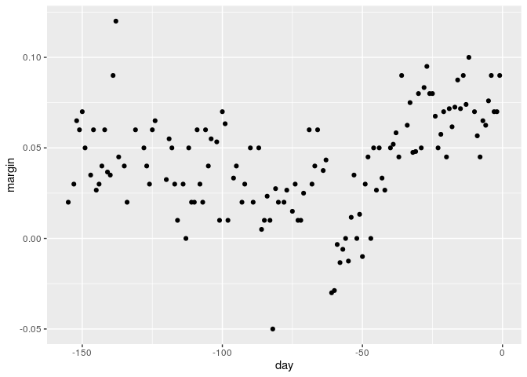

Classification with More than Two Classes
================
PK (Kasidit) Ratanavijai
07/14/2019

# Introduction

We describe how methods qda are not meant to be used with datasets that
have many predictors. This is because the number of parameters that we
need to estimate becomes too large. For example, with the digits example
where we have 784 predictors, lda would have to estimate over 600,000
parameters. With qda, you would have to multiply that by the number of
classes, which is 10.

Kernel methods such k-nearest neighbors or local regression do not have
model parameters to estimate. But they also face a challenge when
multiple predictors are used due to what is referred to as the curse of
dimensionality.

Here, we introduced a set of elegant and versatile methods that adapt to
higher dimensions and also allow these regions to take more complex
shapes, while still producing models that are interpretable

## Classification and Regression Trees (CART)

we will use a new dataset that includes the breakdown of the composition
of olive into eight fatty acids.

``` r
data ("olive") ; olive  = select(olive , - area)
head(olive)
```

    ##           region palmitic palmitoleic stearic oleic linoleic linolenic
    ## 1 Southern Italy    10.75        0.75    2.26 78.23     6.72      0.36
    ## 2 Southern Italy    10.88        0.73    2.24 77.09     7.81      0.31
    ## 3 Southern Italy     9.11        0.54    2.46 81.13     5.49      0.31
    ## 4 Southern Italy     9.66        0.57    2.40 79.52     6.19      0.50
    ## 5 Southern Italy    10.51        0.67    2.59 77.71     6.72      0.50
    ## 6 Southern Italy     9.11        0.49    2.68 79.24     6.78      0.51
    ##   arachidic eicosenoic
    ## 1      0.60       0.29
    ## 2      0.61       0.29
    ## 3      0.63       0.29
    ## 4      0.78       0.35
    ## 5      0.80       0.46
    ## 6      0.70       0.44

``` r
table(olive$region)
```

    ## 
    ## Northern Italy       Sardinia Southern Italy 
    ##            151             98            323

For illustrative purpose, we’ll try to predict the region using the
fatty acid composition values as predictors. It’s either Northern Italy,
Sardinia, or Southern Italy.

Let’s first try our knn model.

``` r
knn_fit = train(region  ~ .,
                method = "knn" ,
                tuneGrid = data.frame(k = seq(1,15,2)), data = olive)

confusionMatrix(data = knn_fit, reference = olive)
```

    ## Bootstrapped (25 reps) Confusion Matrix 
    ## 
    ## (entries are percentual average cell counts across resamples)
    ##  
    ##                 Reference
    ## Prediction       Northern Italy Sardinia Southern Italy
    ##   Northern Italy           24.9      0.0            1.4
    ##   Sardinia                  0.1     16.9            0.3
    ##   Southern Italy            1.2      0.0           55.3
    ##                             
    ##  Accuracy (average) : 0.9706

We get an accuracy of 0.9657.

However, a bit of data exploration reveals that we should be able to do
even better

``` r
olive %>%
  ggplot (aes(eicosenoic, linoleic, col = region)) +
  geom_point()
```

<!-- -->

We can, by eye, construct a prediction rule the partitions the
predictor.If the first predictor is larger than 0.065, B, predict
Southern Italy. If not, then look at the second predictor. And if that’s
larger than 10.535, predict Sardinia, and Northern Italy otherwise.

The general idea is to define an algorithm that uses data to create
trees such as the ones we’ve just shown.

When the outcome is continuous, we call these types of algorithms
**regression trees**.

Regression and decision trees operate by predicting an outcome variable
y by partitioning the predictor space

We’ll use a continuous case, the 2008 poll data introduced earlier, to
describe the basic idea of how we build these algorithms.

We’ll try to estimate the conditional expectation.


``` r
# load the election data
data("polls_2008")
qplot(day,margin,data = polls_2008)
```

<!-- -->

The general idea here is to build a decision tree. And at the end of
each node, we’ll have a different prediction
.

1.  Partition the space into j non-overlapping regions, R1, R2, … Rj
2.  For every observation that follows within a region, let’s say,
    region Rj, we predict the
    
    with the average of all the training observations in that region.
3.  We need to find a predictor j and a value s that define two new
    partitions(R1 and R2).

So how do we pick them? We pick the combination that minimizes the
residual sum of squares defined by this
formula.


``` r
library(rpart)
fit.tree = rpart(margin~ ., data = polls_2008)
#Here's a tree.
plot(fit.tree , margin =  0.01)
text(fit.tree, cex = 0.7)
```

<!-- -->

We end up with eight partitions.The final estimate
 of
x looks like this.

To avoid overtraining, the algorithm sets a minimum for how much the
residual sum of squares must improve for another partition to be added.
This parameter is referred to as the Complexity Parameter, or CP. The
residual sum of squares must improve by a factor of CP the new partition
to be added.

Another aspect of the algorithm we didn’t describe is that it sets a
minimum number of observations to be partitioned. In the rpart package,
that rpart function has an argument called minsplit that lets you define
this. The default is 20. The algorithm also sets a minimum on the number
of observations in each partition. In the rpart function, this argument
is called minbucket.

## Classification (Decision) Trees

When the outcome is categorical, we refer to these methods as
classification trees or decision trees.

The difference is that we can no longer use residual sum of squares to
decide on the partition because the outcomes are categorical. Two of the
more popular ones are the Gini index and entropy. Both of these metrics
seek to partition observations into subsets that have the same class.

Let’s see how classification trees perform on the two or seven

``` r
train_rpart = train(y ~.,
                    method = "rpart",
                    tuneGrid = data.frame(cp = seq(0.0,0.1,len = 25)),
                    data = mnist_27$train)
plot(train_rpart)
```

<!-- -->

We then look at the accuracy versus complexity parameter function, and
we can pick the best complexity parameter from this plot.

``` r
confusionMatrix(predict(train_rpart,
                        mnist_27$test),
                        mnist_27$test$y)$overall["Accuracy"]
```

    ## Accuracy 
    ##     0.82

Note that this is better than logistic regression but not as good as the
kernel methods.

### Summary

Cclassification trees have certain advantages that make them very
useful. They’re highly interoperable, and they sometimes model human
decision processes.  
On the other hand, the recursive partitioning is a bit harder to train
than, for example, linear regression or k-nearest neighbors. Also, it
may not be the best performing method since it’s not very flexible, and
it’s actually quite susceptible to changes in the training data. Random
forests, explained in the next video, improve on several of these
shortcomings.

## Random Forrest

The goal is to improve prediction performance and reduce instability by
averaging multiple decision trees, a forest of trees constructed with
randomness. It has two features that help accomplish this. The first
feature is referred to as bootstrap aggregation, or bagging.

1.  Build many decision trees, T1 through TB, using the training set.
2.  For every observation
     in the test
    set, we form a prediction
    
    using tree
    .

Now, to obtain a final prediction, we combine the predictions for each
tree in two different ways, one for continuous outcomes and one for
categorical outcomes.

For continuous outcomes, simply take the average of the y hat
j’s.


For categorical data, we predict y hat with a majority vote. The class
that appears most across all the trees is the one we predict.

Then we use bootstrap get many decision trees from a single training
set. We create a bootstrap training set by sampling N observations from
this training set with replacement. Now we build a decision tree for
each one of these bootstrap training sets. And then we apply the
algorithm that we just described to get a final prediction.

``` r
#apply random forrest
library(randomForest)
```

    ## randomForest 4.6-14

    ## Type rfNews() to see new features/changes/bug fixes.

    ## 
    ## Attaching package: 'randomForest'

    ## The following object is masked from 'package:dplyr':
    ## 
    ##     combine

    ## The following object is masked from 'package:ggplot2':
    ## 
    ##     margin

``` r
fit_forest = randomForest(margin~ ., data = polls_2008)
plot(fit_forest)
```

<!-- -->

If you plot the object that comes out of this function like this, we get
a plot of the error versus the number of trees that have been created.
After 200 trees, the algorith does not change much, but note that for
more complex problems will require more trees for the algorithm to
converge.

Here is the final result for the polls 2008 data. Note that the final
result is somewhat smooth.

``` r
polls_2008 %>% mutate(smooth = fit_forest$predicted) %>%
  ggplot(aes(day, margin)) +
  geom_point(size =1.5, alpha =.8) +
  geom_line(aes(day,smooth) , color = "red")+
  theme_light()
```

<!-- -->

Let’s fit a random forrest with another sample with 2 or 7 data set.

``` r
train_rf = randomForest( y ~ ., data = mnist_27$train)

confusionMatrix( predict( train_rf, mnist_27$test),
                 mnist_27$test$y)$overall["Accuracy"]
```

    ## Accuracy 
    ##    0.795

So we can control the smoothness of the random forest estimate in
several ways. One is to limit the size of each node. We can require the
number of points per node to be larger. A second feature is that we can
use a random selection of features to use for the splits.

## Other Algorithms

We can use many other algorithms from caret packages. It currently
includes 237 different methods.

For example, the

function lets us train different algorithms using similar
syntax.

``` r
#We have seen many examples of train() from previous part such ass logistic regression or knn
train_glm = train( y ~ .,
                   data = mnist_27$train, method = "glm")
train_knn = train(y~ .,
                  data = mnist_27$train , method="knn")
```

Then We make prediction from the output of train like this.

``` r
y_hat_glm = predict (train_glm, data = mnist_27$test,type = "raw")
y_hat_knn = predict(train_glm, data = mnist_27$test,type = "raw")
```

Finally, we can compare the accuracy with the
confusionMatrix.

``` r
confusionMatrix(data = y_hat_glm , reference =mnist_27$test$y)$overall["Accuracy"]
confusionMatrix(data = y_hat_knn, reference = mnist_27$test$y)$overall["Accuracy"]
```

### Tuning Parameters with Caret

To find out what parameter or parameters are optimized, You can do a
quick lookup using the model lookup function like this. When we run this
code, we see that for knn, the parameter that’s optimized is k.

``` r
modelLookup("knn")
```

    ##   model parameter      label forReg forClass probModel
    ## 1   knn         k #Neighbors   TRUE     TRUE      TRUE

Then you can quickly see the results of the cross-validation using the
ggplot function. By default, the cross-validation is performed by
testing on 25 bootstrap samples comprised of 25% of the observations.
Also, for the knn method, the default is to try out k=5, 7, and 9. We
already saw that 9 maximizes this. But maybe there’s another k that’s
even
better.

``` r
ggplot(train_knn,hilight=TRUE)
```

<!-- -->

So to change this, we need to use the tunegrid parameter in the train
function.

The grid of values that are going to be compared must be supplied by a
data frame with the column names as specified by the parameters that you
get in the model lookup output. We can try out 30 values between 9 and
71.

``` r
train_knn = train(y~.,
                  method="knn",
                  data = mnist_27$train,
                  tuneGrid = data.frame(k = seq(9,71,2)))
ggplot(data= train_knn, hilight= TRUE)
```

<!-- -->

In the plot, we can see the k that maximizes accuracy.

``` r
#We can also access it by
train_knn$bestTune
```

    ##     k
    ## 10 27

``` r
#We can also access the best-performing model
train_knn$finalModel
```

    ## 27-nearest neighbor model
    ## Training set outcome distribution:
    ## 
    ##   2   7 
    ## 379 421

So now, if we can see the accuracy we obtain on the test set

``` r
confusionMatrix(data =train_knn , reference = mnist_27$test$y)
```

    ## Bootstrapped (25 reps) Confusion Matrix 
    ## 
    ## (entries are percentual average cell counts across resamples)
    ##  
    ##           Reference
    ## Prediction    2    7
    ##          2 39.4  8.0
    ##          7  7.8 44.8
    ##                            
    ##  Accuracy (average) : 0.842

#### Summary

Note that not all parameters in machine-learning algorithms are tuned.
For example, in regression models or in LDA, we fit the best model using
the squares estimates or maximum likelihood estimates. Those are not
tuning parameters. We obtained those using least squares, or MLE, or
some other optimization technique.

Parameters that are tuned are parameters that we can change and then get
an estimate of the model for each one. So in k-nearest neighbors, the
number of neighbors is a tuning parameter.
