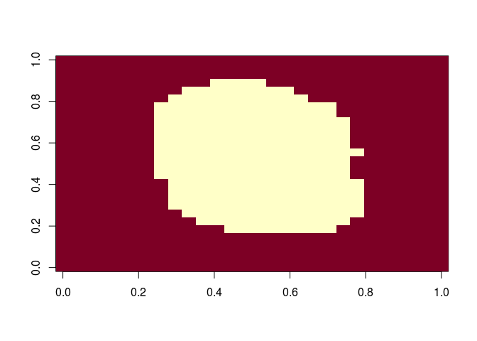
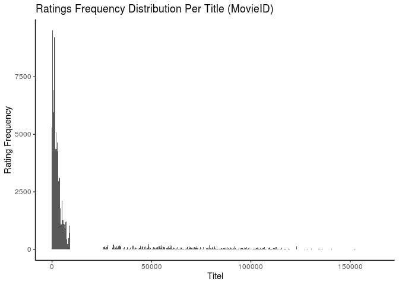
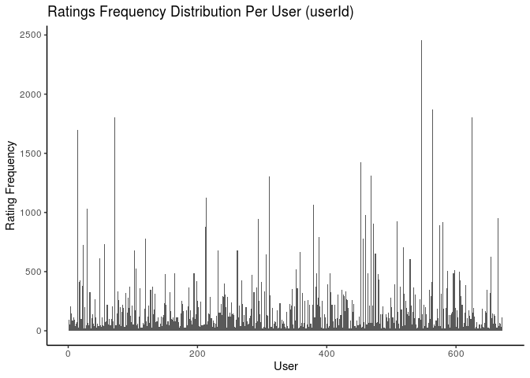

Model Fitting and Recommendation Systems Overview
================
PK (Kasidit) Ratanavijai
7/18/2019

## Case study : MNIST

### Introduction

We have learned several machine learning algorithms and demonstrated how
to use them with illustrative examples. But we are now going to try them
out on a real example. This is a popular data set used in machine
learning competitions called the MNIST digits.

``` r
mnist = read_mnist()
names(mnist)
```

    ## [1] "train" "test"

Each of these components includes a matrix with features in the columns.

``` r
str(mnist)
```

    ## List of 2
    ##  $ train:List of 2
    ##   ..$ images: int [1:60000, 1:784] 0 0 0 0 0 0 0 0 0 0 ...
    ##   ..$ labels: int [1:60000] 5 0 4 1 9 2 1 3 1 4 ...
    ##  $ test :List of 2
    ##   ..$ images: int [1:10000, 1:784] 0 0 0 0 0 0 0 0 0 0 ...
    ##   ..$ labels: int [1:10000] 7 2 1 0 4 1 4 9 5 9 ...

We will sample 10,000 random rows from the training set and 10,000
random rows from the test set.

``` r
set.seed(123)
#create train set
index = sample (nrow(mnist$train$images), 10000)
x= mnist$train$images[index,]
y = factor(mnist$train$labels[index])
#create test set 
index = sample (nrow(mnist$test$images), 1000)
x_test = mnist$test$images[index,]
y_test  = factor(mnist$test$labels[index])
```

### Preprocessing MNIST Data

Examples of pre-processing include standardizing the predictors, taking
the log transform of some predictors or some other transformation,
removing predictors that are highly correlated with others, and removing
predictors with very few non-unique values or close to zero variation.

The example here is try to remove features with zero variability, or
almost zero variability with function nearZeroVar

``` r
nzv = nearZeroVar(x)
image(matrix(1:784 %in% nzv, 28, 28))
```

<!-- -->

Once we remove them, we end up keeping 253 column.

``` r
col_index <- setdiff(1:ncol(x), nzv)
length(col_index)
```

    ## [1] 249

### Model Fitting for MNIST Data

Before we start on knn or random forrest model, we need to add column
names to the feature matrices, as this is a requirement of the caret
package.

``` r
colnames(x) <- 1:ncol(mnist$train$images)
colnames(x_test) <- colnames(mnist$train$images)
```

#### KNN model

The first step is to optimize for the number of neighbors.

``` r
control <- trainControl(method = "cv", number = 10, p = .9)
train_knn <- train(x[,col_index], y, 
                   method = "knn", 
                   tuneGrid = data.frame(k = c(3,5,7)),
                   trControl = control)
train_knn
```

    ## k-Nearest Neighbors 
    ## 
    ## 10000 samples
    ##   249 predictor
    ##    10 classes: '0', '1', '2', '3', '4', '5', '6', '7', '8', '9' 
    ## 
    ## No pre-processing
    ## Resampling: Cross-Validated (10 fold) 
    ## Summary of sample sizes: 8998, 9000, 9002, 8999, 9001, 8999, ... 
    ## Resampling results across tuning parameters:
    ## 
    ##   k  Accuracy   Kappa    
    ##   3  0.9463050  0.9402965
    ##   5  0.9455064  0.9394055
    ##   7  0.9418067  0.9352904
    ## 
    ## Accuracy was used to select the optimal model using the largest value.
    ## The final value used for the model was k = 3.

Once we optimize our algorithm, we can fit it to the entire dataset:

``` r
fit_knn <- knn3(x[, col_index], y,  k = 3)

y_hat_knn <- predict(fit_knn, x_test[, col_index], type="class")
cm <- confusionMatrix(y_hat_knn, factor(y_test))
cm$overall["Accuracy"]
```

    ## Accuracy 
    ##     0.94

#### Random forest

Here we use the random forest implementation in the Rborist package,
which is faster than the one in the random forest package.

Because with random forest the fitting is the slowest part of the
procedure rather than the predicting (as with kNN), we will use only
5-fold cross validation. We will also reduce the number of trees that
are fit since we are not yet building our final model.

Finally, to compute on a smaller dataset, we will take a random sample
of the observations when constructing each tree. We can change this
number with the nSamp argument.

``` r
library(Rborist)
control <- trainControl(method="cv", number = 5, p = 0.8)
grid <- expand.grid(minNode = c(1) , predFixed = c(10, 15, 35))

train_rf <-  train(x[, col_index], 
                   y, 
                   method = "Rborist", 
                   nTree = 50,
                   trControl = control,
                   tuneGrid = grid,
                   nSamp = 5000)

ggplot(train_rf)
train_rf$bestTune
```

Now that we have optimized our tree, we are ready to fit our final
model:

``` r
fit_rf <- Rborist(x[, col_index], y, 
                  nTree = 1000,
                  minNode = train_rf$bestTune$minNode,
                  predFixed = train_rf$bestTune$predFixed)

y_hat_rf <- factor(levels(y)[predict(fit_rf, x_test[ ,col_index])$yPred])
cm <- confusionMatrix(y_hat_rf, y_test)
cm$overall["Accuracy"]
```

With some further tuning, we can get even higher accuracy.

## Reccomdation system

### Introduction

Recommendation systems use ratings that users have given items to make
specific recommendations to users. Companies like Amazon that sell many
products to many customers and permit these customers to rate their
products are able to collect massive data sets that can be used to
predict what rating a given user will give a specific item. Items for
which a high rating is predicted for specific users are then recommended
to that user.

Netflix uses recommendation systems to predict how many stars a user
will give a specific movie.

Unfortunately, the Netflix data is not publicly available. But the
GroupLens research lab generated their own database with over 20 million
ratings for over 27,000 movies by more than 138,000 users.

``` r
str(movielens)
```

    ## 'data.frame':    100004 obs. of  7 variables:
    ##  $ movieId  : int  31 1029 1061 1129 1172 1263 1287 1293 1339 1343 ...
    ##  $ title    : chr  "Dangerous Minds" "Dumbo" "Sleepers" "Escape from New York" ...
    ##  $ year     : int  1995 1941 1996 1981 1989 1978 1959 1982 1992 1991 ...
    ##  $ genres   : Factor w/ 901 levels "(no genres listed)",..: 762 510 899 120 762 836 81 762 844 899 ...
    ##  $ userId   : int  1 1 1 1 1 1 1 1 1 1 ...
    ##  $ rating   : num  2.5 3 3 2 4 2 2 2 3.5 2 ...
    ##  $ timestamp: int  1260759144 1260759179 1260759182 1260759185 1260759205 1260759151 1260759187 1260759148 1260759125 1260759131 ...

``` r
head(movielens)
```

    ##   movieId                                   title year
    ## 1      31                         Dangerous Minds 1995
    ## 2    1029                                   Dumbo 1941
    ## 3    1061                                Sleepers 1996
    ## 4    1129                    Escape from New York 1981
    ## 5    1172 Cinema Paradiso (Nuovo cinema Paradiso) 1989
    ## 6    1263                        Deer Hunter, The 1978
    ##                             genres userId rating  timestamp
    ## 1                            Drama      1    2.5 1260759144
    ## 2 Animation|Children|Drama|Musical      1    3.0 1260759179
    ## 3                         Thriller      1    3.0 1260759182
    ## 4 Action|Adventure|Sci-Fi|Thriller      1    2.0 1260759185
    ## 5                            Drama      1    4.0 1260759205
    ## 6                        Drama|War      1    2.0 1260759151

We can see that the movie lens table is tidy formant and contains
thousands of rows. Each row represents a rating given by one user to one
movie.

``` r
movielens %>%
  summarize(n_users = n_distinct (userId),
            n_movies= n_distinct (movieId))
```

    ##   n_users n_movies
    ## 1     671     9066

We can think of this data as a very large matrix with users on the rows
and movies on the columns with many empty cells(N/A) beceause 1 user not
rated all the movie.

Each outcome y has a different set of predictors. To see this, note that
if we are predicting the rating for movie i by user u, in principle, all
other ratings related to movie i and by user u may be used as
predictors.

Furthermore, we may be able to use information from other movies that we
have determined are similar to movie i or from users determined to be
similar to user u. So in essence, the entire matrix can be used as
predictors for each cell.

### Data exploration

The first thing we notice is that some movies get rated more than
others. Here’s the distribution. This should not surprise us given that
there are blockbusters watched by millions and artsy independent movies
watched by just a few.

``` r
ggplot(movielens, aes(movieId)) +
  theme_classic()  +
  geom_histogram(bins=500) +
   labs(title = "Ratings Frequency Distribution Per Title (MovieID)",
        x = "Titel",
        y = "Rating Frequency")
```

<!-- -->

A second observation is that some users are more active than others at
rating movies. Notice that some users have rated over 1,000 movies while
others have only rated a handful.

``` r
ggplot(movielens, aes(userId)) +
  theme_classic()  +
  geom_histogram(bins=500) +
   labs(title = "Ratings Frequency Distribution Per User (userId)",
        x = "User",
        y = "Rating Frequency")
```

<!-- -->

### The residual mean squared error.

So let’s create a test set to assess the accuracy of the models we
implement, just like in other machine learning algorithms.

``` r
set.seed(755)
test_index <- createDataPartition(y = movielens$rating, times = 1, p = 0.2, list = FALSE)
train_set <- movielens[-test_index,]
test_set <- movielens[test_index,]

test_set <- test_set %>% 
  semi_join(train_set, by = "movieId") %>%
  semi_join(train_set, by = "userId")
```

To compare different models or to see how well we’re doing compared to
some baseline, we need to quantify what it means to do well. We need a
loss function. The Netflix challenge used the typical error and thus
decided on a winner based on the residual mean squared error on a test
set. So if we define

as the rating for movie
 by user
 and denote our
prediction with
.
The RMSE is then defined
as:


Here n is a number of user movie combinations and the sum is occurring
over all these combinations. Remember that we can interpret the residual
mean squared error similar to standard deviation. It is the typical
error we make when predicting a movie rating.

``` r
#function to compute RMSE
RMSE = function(true_ratings , predicted_ratings) {
  sqrt(mean((true_ratings - predicted_rating)^2))
}
```

### Building the Recommendation System

#### Naive Model

We will implement two general classes of models. One was similar to
k-nearest neighbors, where you found movies that were similar to each
other and users that were similar to each other. The other one was based
on an approach called matrix factorization.

Let’s start by building the simplest possible recommendation system: we
predict the same rating for all movies regardless of user. What number
should this prediction be? We can use a model based approach to answer
this. A model that assumes the same rating for all movies and users with
all the differences explained by random variation would look like
this:


We know that the estimate that minimizes the RMSE is the least squares
estimate of μ and, in this case, is the average of all ratings:

``` r
mu_hat <- mean(train_set$rating) ;mu_hat
```

    ## [1] 3.543305

we obtain the following RMSE

``` r
naive_rmse <- RMSE(test_set$rating, mu_hat) ;naive_rmse
```

As we go along, we will be comparing different approaches. Let’s start
by creating a results table with this naive
approach:

``` r
rmse_results <- data_frame(method = "Just the average", RMSE = naive_rmse)
```
